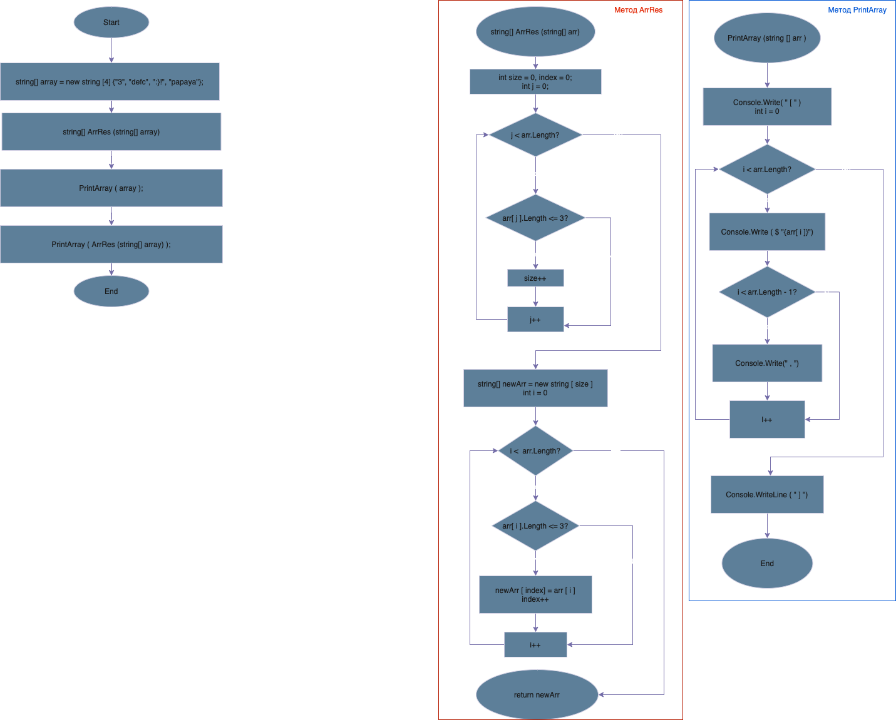

# Итоговая проверочная работа

## Ход работы
Для полноценного выполнения проверочной работы необходимо: 
1. Создать репозиторий на GitHub
2. Нарисовать блок-схему алгоритма (можно обойтись блок-схемой основной содержательной части, если вы выделяете ее в отдельный метод)
3. Снабдить репозиторий оформленным текстовым описанием решения (файл REAmvfE.md)
4. Написать программу, решающую поставленную задачу
5. Использовать контроль версий в работе над этим небольшим проектом.

## Задача

Написать программу, которая из имеющегося массива строк формирует массив из строк, длина которых меньше либо равна З символа. Первоначальный массив можно ввести с клавиатуры, либо задать на старте выполнения алгоритма. При решении не рекомендуется пользоваться коллекциями, лучше обойтись исключительно массивами.

## Блок-схема 



## Описание кода
1. Инициализируем и заполняем массив из строк.
```
string[] array = new string [4]{"3", "defc", ":}!", "papaya"};
```
2. Инициализируем и пропишем метод вывода массива в консоль.
**PrintArray()**
```
void PrintArray(string[] arr)
{
    Console.Write("[");
    for(int i = 0; i < arr.Length; i++)
    {
        Console.Write($"{arr[i]}");
        if (i < arr.Length - 1) Console.Write(", ");
    }
    Console.WriteLine("]");
}
```
3. Инициализируем и пропишем метод сортировки массива по условию из "Дано".
**ArrRes()**
```
string[] ArrRes (string[] arr)
{
    int size = 0, index = 0; 

    for (int j = 0; j < arr.Length; j++) //(1)
        if (arr[j].Length <= 3) size++;

    string[] newArr = new string [size]; //(2)

    for (int i = 0; i < arr.Length; i++) //(3)
    {
        if (arr[i].Length <= 3)
        {
            newArr[index] = arr[i];
            index++;
        }
    }
    return newArr; //(4)
}
```
- (1) Считаем длину для нового массива.
- (2) Создаём новый массив.
- (3) Подставляем значения (<= 3 символов) в новый массив.
- (4) Возвращаем созданный массив.

4. Вызываем ранее созданные методы
**PrintArray()** и **ArrRes()**
```
PrintArray(array);
PrintArray(ArrRes(array));
```
5. Результат работы программы:
```
[3, defc, :}!, papaya] // исходный массив
[3, :}!]              // результирующий массив
```

# THE END

_Выпонила Усольцева Олеся </br>Студент GeekBrains_